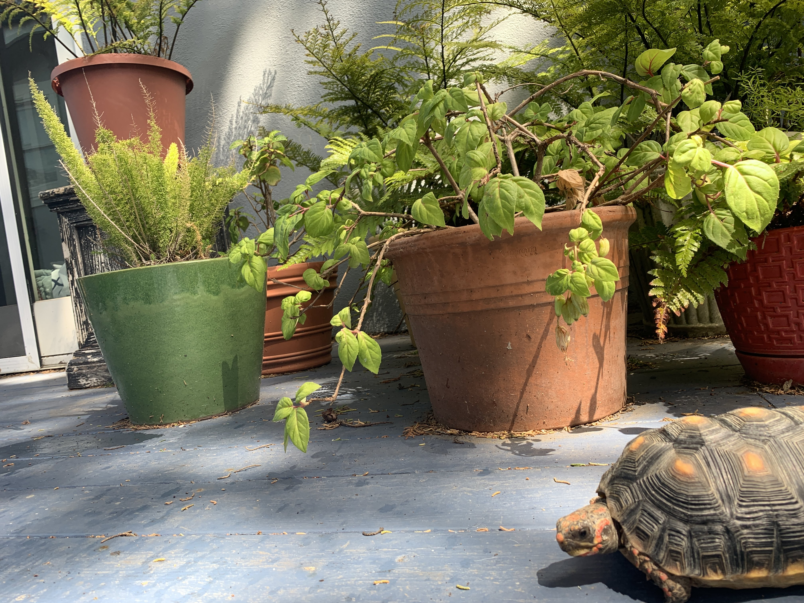

# up206a-lupe
## About Me: 
My name is Guadalupe Velez, I grew up in Minneapolis, Minnesota after my parents migrated from Chihuahua Mexico. I also lived with my mom and sister in Denver, Colorado before I did my undergrad at the University of California Santa Cruz studying Latin American and Latino Studies and Education. I am currently a first year MURP with a concentration in Community Economic Development and Housing. 

I have a pet tortoise named Chickpea: 

## Intro to GIS Course Description: 
We begin with an introduction to various data science tools, and review the basics of programming with Python. Once a foundation of Python programming and data wrangling is achieved, spatial analysis through Python Libraries, and subsequently, through advanced geoprocessing will be introduced. All lessons will be based on “real” data with analytical methods addressing relevant and contemporary urban problems. At the conclusion of this course, students will be able to critically describe, analyze, and visualize spatial data for planning practices and research.

## Learning Objectives: 
I have no previous experience with GIS and mapmaking, coding or Python; however I want to put myself out of my comfort zone in order to learn a new valuable skill. By the end of the class I want to be able to: 

* Analyze and visualize data in a new way.
* Obtain a basic understanding of Python programming and data wrangling.
* Learn research methods and organizing data.
* Understand how to utilize data to create tables, charts, graphics. 
* Think spatially in order to better understand racial/social inequities 
* Raise awareness/find ways to raise awareness to racial and social inequities 

## Project Ideas: 
I am interested in the development of affordable housing, displacement and homelessness. 

**Project Ideas could include**: 
* Mapping sites that are eligible to become affordable housing, juxtaposed with ongoing private development 
* Identifying areas of high eviction rates and identifying communities of high risk
* Visualizing the history and change of neighborhoods, trends, zoning laws, racial makeup, demographics, development. 
* How climate change impacts low income communities and people of color.